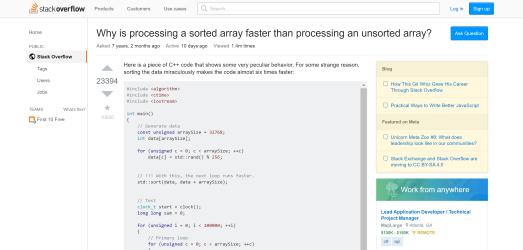
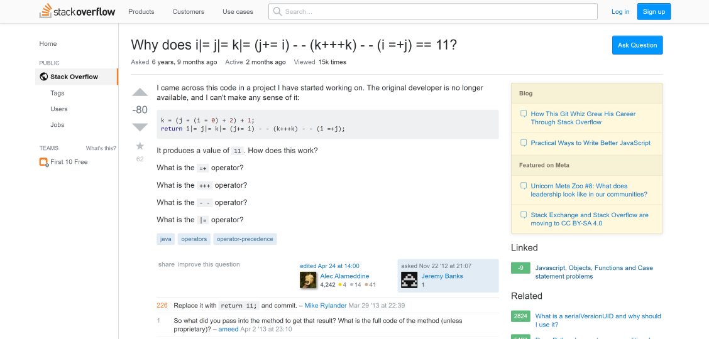

When we were younger, we were told that there is no such thing as a "stupid question" -- which is true (to some extent). What we 
consider a "stupid question" is nothing more than just an ill-informed, poorly-constructed question that can be worded to a higher degree
of intelligence. This is especially notable in the realm of programming. Programmers -- regardless of how much experience they have --
will always ask questions, always look for answers. However, according to Eric Raymond's **["How to Ask Questions"](http://www.catb.org/esr/faqs/smart-questions.html)**,
the satisfaction received from these answers depends on just how "smart" the question poses itself. 

## The Satisfaction of Smart Questions
-----

Generally, when we ask questions, it's because we don't know the answer -- so we look to the experts for help. For programming,
we look to the more experienced programmers ("hackers", as what Raymond calls himself and others among the same level of expertise) for 
our solutions. Raymond refers to "answering a good question" as a stimuli and a gift. In other words, if the question is 
thought-provoking, insightful, clearly looking to understand the concept behind the code, it will be received in a good light and the
answers that come out of it are satisfactory. Questions that can be answered merely by a Google search, or where the asker is clearly 
just looking for an answer to copy, are more likely to be blown off. 

Besides Google, StackOverflow is home to many of our programming answers, where if we ask, we shall receive (most of the time). However, 
since it's a forum that anyone can just use, you've got the "smart" questions and the "not so smart" questions mixed in there side by 
side. Below are two questions asked on StackOverflow that exhibits an example of a "smart" question, and a "not smart" question. 

## A "Smart" Question
-----
Let's start off with a **[very intelligent question](https://stackoverflow.com/questions/11227809/why-is-processing-a-sorted-array-faster-than-processing-an-unsorted-array/11227902#11227902)** asked by a genuinely curious asker. 

[comment]: 

This is a question, by Raymond's standards, that hackers see as a stimulus and a gift. The asker clearly attempts to figure out why
processing a sorted array is faster than processing an unsorted array -- not just once, but twice, in C++ *and* in Java. They have 
results for the first attempt, they have a result for their second attempt. They have their examples to support their questions, and 
are still eager to figure out the answer. They end their post with insightful questions:

> My first thought was that sorting brings the data into the cache, but then I thought how silly that was because the 
> array was just generated.
> What is going on?
> Why is processing a sorted array faster than processing an unsorted array? The code is summing up some independent terms,
> so the order should not matter.

The responses to the post exhibit the same amount of enthusiasm and insightfulness. The most upvoted response gave an analogy that
elaborately related branch predictions to sorting arrays, which gave a perfect answer that provoked thoughtfulness every step of the 
way.

## A "Not Smart" Question
-----

Now let's move onto **[a question that isn't necessarily a dumb question](https://stackoverflow.com/questions/13519990/why-does-i-j-k-j-i-kk-i-j-11)**, but one that isn't very thought-provoking.

[comment]: 
[comment]: fjlk
The questions asked in this post could have easily been solved through a simple Google search. Asking "How does this work?" may elicit
some thought, but the asker doesn't show any signs of attempt at this problem, and is in fact just looking for an immediate answer to 
their question. Raymond states that you should always look for the answers in Google first, as there might easily be someone out
there that has already asked the question you're trying to answer. In addition, he also stated that going to a forum like 
StackOverflow and posting elementary questions might get you "written off as a loser", which is clearly evident in the amount of
downvotes this question received. A question about operators and an old piece of code, in this case, is a question that could have easily been solved independently.

## Question Your Questions
-----

Clearly, the enthusiasm, elaboration, and insight in which people give answers is directly related to the complexity and
thoughtfulness applied to questions through strategic wording. Asking a very plain question doesn't always elicit 
satisfactory responses, especially if the question you can ask can be simply resolved by a Google search. If the Google search
doesn't help, try software examples yourself and have receipts before you get to posting your question on a forum. And when you
do, make sure the experts know you've tried your best attempts at solving the problem so that you don't get written off as an
"ill-informed" novice. 

