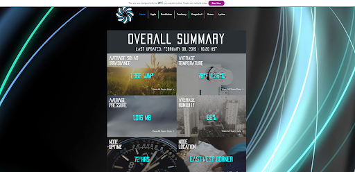
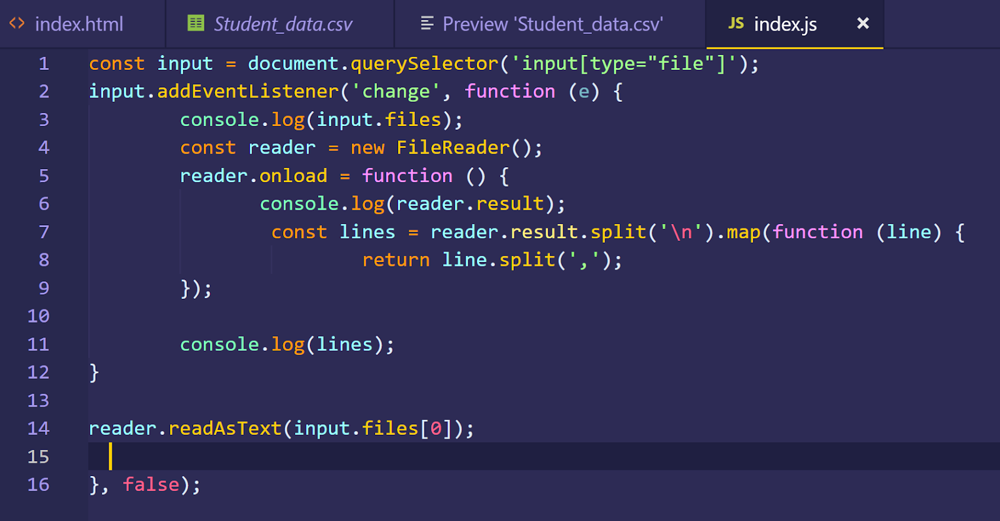
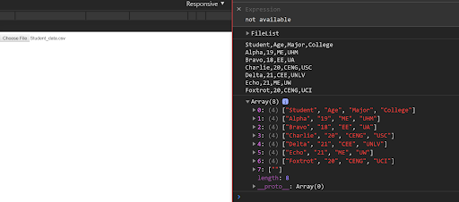

  
  
  
  

The Smart Campus Energy Lab, or SCEL, strives to create a meteorological sensor platform
throughout the University of Hawaii at Manoa, while utilizing renewable energy source
devices that are both cost-efficient and self-sustaining. These SCEL weatherboxes allow the
collection of weather data to determine optimal locations around the campus at UHM. 

As the Dashboard team, our primary objective is to obtain the meteorological data sent by
SCEL’s weatherboxes and display it in an accessible user interface (i.e. UI) via graphical and
numerical representations. Further, the purpose of creating this UI is to pull and grab data from
the SCEL server, update and manipulate the data accordingly, and organize that data through
simple navigation on the Dashboard UI. The foundations of this Dashboard stems from learning
web development languages, which we needed to self-teach ourselves throughout the semester.

We encountered issues with accomplishing these goals, mainly due to the fact that we were
extremely unfamiliar with most of the materials and tools used. The learning curve was
definitely a roadblock in our process but we were able to create our ideal UI by the end of the
semester.

We began by designing a mockup on paper, followed by creating an electronic copy of
that mockup. The next step entailed drafting a programmed design of the user interface, and from
there, develop a successful product that performed the basic functionalities of the Dashboard.
The last step required us to review our design and improve any elements.

Our next step after creating an electronic mockup was to completely reconstruct the website using 
HTML and CSS alone, without the use of any other external libraries or APIs. We coded simplistic versions
of the elements from the ideal website, from the containers of the group data, to the menu bar, to the 
layout of the page. The prototypes were nonfunctional, but they served as the foundations for our final UI
product. Programming these elements via straight HTML and CSS proved to be a challenge, until aspects from 
ICS 314 could be applied, which heavily improved the quality and the aesthetic of the UI. 

Once we had the final UI layout set up, we divided the team into two tasks: maintaining the UI and creating the
data parser. The purpose of the data parser is to scan the data from .csv files and turn it into objects to be 
stored, manipulated, and transformed into graphical representations. However, the parser was one of the most the 
challenging aspect of this project, as we learned that coding a parser solely with Javascript is both inefficient 
and nonideal for any website. The parser went through several different recreations due to errors and invalid 
parsing, which was found and debugged using the Google Chrome DevTool. Initially, we created a line-by-line 
delimiter that tried to open and read data from a prototype .csv file with fake student data. This was unsuccessful,
and so we tried to include more delimiters and figure out how to open and read input files. We also trashed and
utilized different APIs, such as Papa Parse, to read the file and automatically parse the data using functions
from the APIs; however, they would bring up file reading errors and invalid functions, even though the code was 
syntactically correct and should have hypothetically worked. We eventually settled on a simple data parser to
save for time, which does in fact read the data from an uploaded .csv file and parse the data into an object array. 

