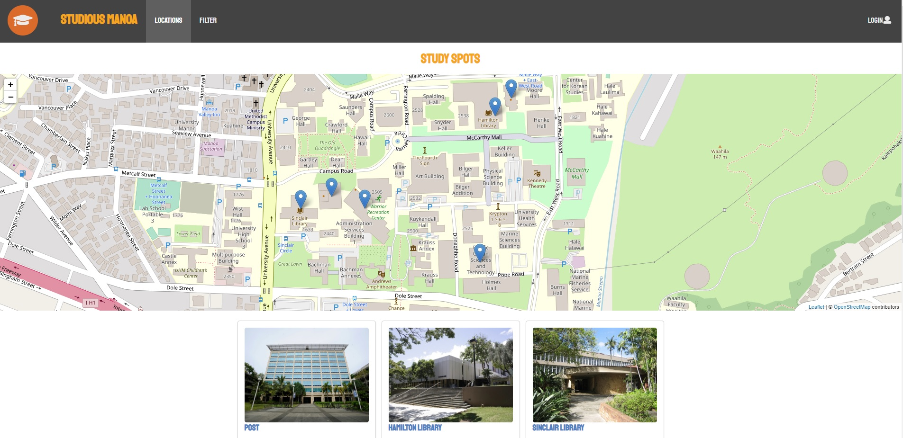
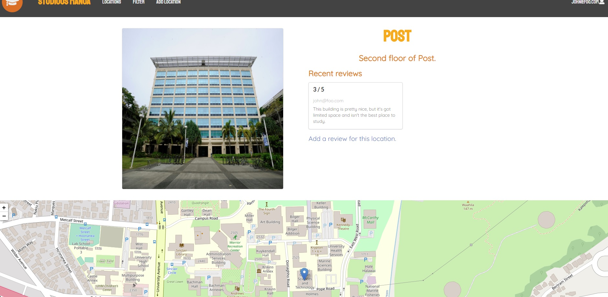
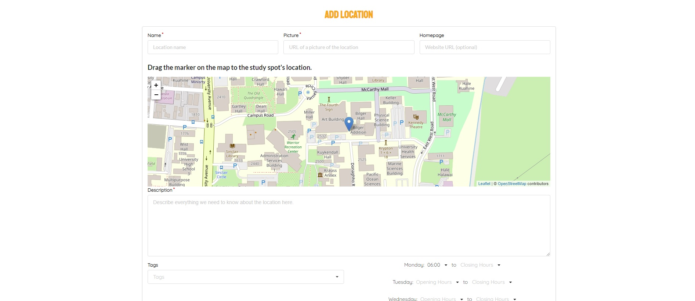

  
  
  
  

*Ever wonder where's a good place to study at and around UH Manoa?*

Studious Manoa is a full stack web application that allows people in the UH community to find places where
they can kick back, whip out their notes, and study. This project features a map in which you can find your 
study spot, as well as gives you a detailed list of the different spots and what people think of them. Inspired
somewhat by Yelp, Studious Manoa is designed to not only help students find their right study space, but also
to encourage them to continuously use our interface.

This project was created by a group of 5 talented individuals: 

    - Eric Botello
    - Nathaniel Tomchak
    - Jianna Orias (yours truly!)
    - Sahra Moseby
    - Rebecca Vatnebryn
 
 This was a month-long process that required an immense collaborative effort over Slack and GitHub. Our end product
 can be found [here](http://studiousmanoa.meteorapp.com/#). See our documented progress at our official [GitHub](https://studious-manoa.github.io/)!
 
While this was a collaborative effort, I was in charge of most of the UI design and layouts of the website, as well as
fixing up functionalities (e.g. the NavBar, Footer, Search Engine), minor bugs, and deployment of the web application. 
