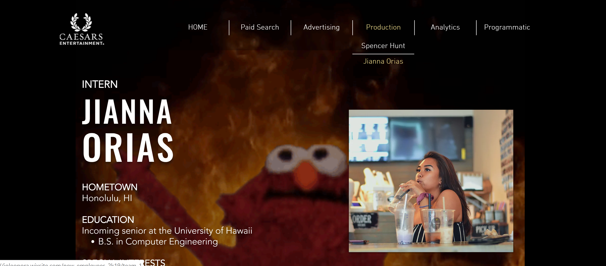

  
  

## Fun Little Thing
Like the summary stated, this isn't a programming related project at all -- this was more of a showcase of my
project management skills (which got me major brownie points). 

A little background: I was an eCommerce Global Product Intern with Caesars Entertainment in Las Vegas, NV over
the summer (my second summer with them). This summer happened to have quite a number of new employees, so the
VP of the department gathered us altogether in a lunch and tasked us with creating a new employee project that 
was "creative and mind-blowing". 

As intern, I was already editing and managing the Caesars property websites through Adobe Experience Manager, 
so I suggested that we make a website where everyone can edit their own page that gave a basic introduction
of themselves. With that suggestion + the fact that I was the only "new employee" in college "still doing 
presentations of the sort", the group automatically assigned me the leader of the group. 

Using Wix, I created a basic homepage layout that was both easy to navigate and still under Caesars' website 
aesthetic. I corralled everyone's information into a basic layout that they could edit and set up a schedule
that they could edit their page (since Wix only allows one person to edit at a time). Here's the final result: 
**[Summer 2019 New Employees](https://joleonora.wixsite.com/new-employees-2k19")**

